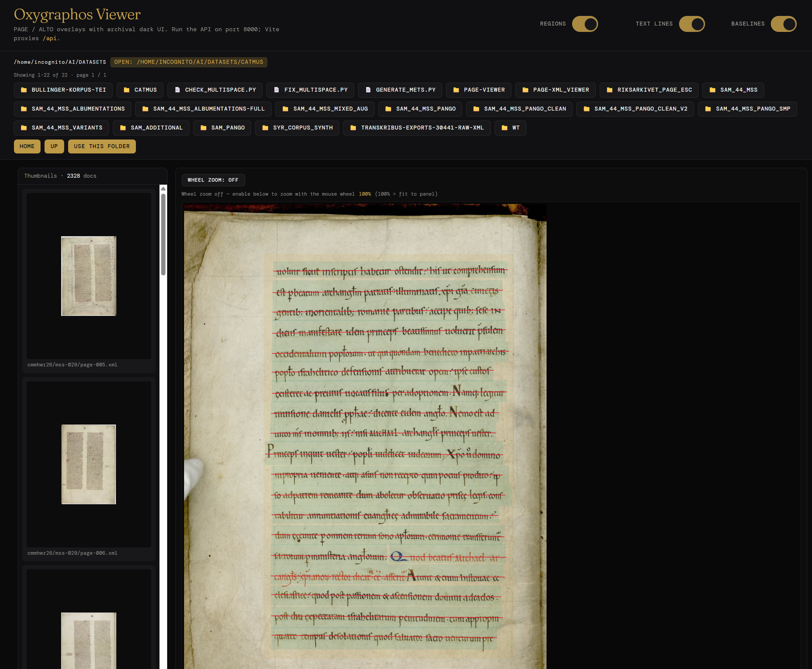

# Oxygraphos Viewer

[](LICENSE)

**Oxygraphos Viewer** is a production-oriented web app for browsing scanned pages with **PAGE-XML** and **ALTO-XML** layout overlays. Pick a folder of paired XML + images, page through thumbnails, and inspect regions, text lines, and baselines on a dark “archival” UI.

**Repository:** [github.com/johnlockejrr/oxygraphos-viewer](https://github.com/johnlockejrr/oxygraphos-viewer)

## Screenshot

Example of the main UI (thumbnails, scan, and overlays).



---

## Features

- **Directory browser** scoped by `ALLOWED_ROOT`, with pagination for large folders.
- **PAGE-XML** (multiple schema years) and **ALTO** (2.x–4.x): regions, text lines, baselines; coordinates normalized on the server for crisp SVG overlays.
- **eScriptorium-style PAGE**: text lines in “dummy” `TextRegion`s without region `<Coords>` are still parsed (bounds derived from lines).
- **Thumbnails** (JPEG cache), **lazy loading**, **layer toggles** (regions / text lines / baselines), **wheel zoom** with reset when zoom is turned off.
- **FastAPI** backend + **SvelteKit** (Svelte 5) frontend with Tailwind and shadcn-style primitives.

---

## Stack

| Layer | Technology |
|--------|------------|
| API | Python 3.11+, FastAPI, lxml, Pillow, Pydantic Settings |
| UI | SvelteKit, Vite, Tailwind CSS, shadcn-svelte-style components |
| Dev | uv (recommended), npm, pytest, httpx |

---

## Prerequisites

- **Python** 3.11+
- **[uv](https://github.com/astral-sh/uv)** (recommended) or `pip`
- **Node.js** 20+ and **npm** (for `frontend/`)

---

## Quick start

### 1. Clone and environment

```bash
git clone https://github.com/johnlockejrr/oxygraphos-viewer.git
cd oxygraphos-viewer

uv venv
# Windows: .venv\Scripts\activate
source .venv/bin/activate

uv sync --extra dev
```

Alternatively, without uv:

```bash
python -m venv .venv
source .venv/bin/activate
pip install -r requirements.txt
pip install httpx pytest
```

### 2. Configuration

```bash
cp .env.example .env
```

Edit `.env` at minimum:

- **`ALLOWED_ROOT`** — absolute path; the app will only read files under this tree (defaults to your home directory if unset in code, but `.env.example` expects an explicit path).

See [Environment variables](#environment-variables) for the full list.

### 3. Run the backend

From the **repository root** (where the `app/` package lives):

```bash
uv run uvicorn app.main:app --reload --host 127.0.0.1 --port 8000
```

API base: `http://127.0.0.1:8000` — OpenAPI docs: `http://127.0.0.1:8000/docs`.

### 4. Run the frontend (development)

In a second terminal:

```bash
cd frontend
npm install
npm run dev
```

The dev server (usually `http://localhost:5173`) proxies **`/api`** to `http://127.0.0.1:8000`.

Open the UI, browse to a directory that contains **XML + image pairs** (same stem, or linked via PAGE `imageFilename` / ALTO layout rules), then choose **Use this folder** and open a thumbnail.

---

## Environment variables

| Variable | Description |
|----------|-------------|
| `ALLOWED_ROOT` | Root path for all file access; required for safe browsing. |
| `BROWSE_START_PATH` | Optional. First folder listed when opening the directory browser with no `path` (must be under `ALLOWED_ROOT`). |
| `THUMB_CACHE_DIR` | Optional. Absolute path for JPEG thumbnails; default is under the system temp directory. |
| `THUMB_SIZE` | Longest side for thumbnails (default `150`). |
| `PAGE_SIZE` | Documents per page in `/api/docs` (default `20`). |
| `MAX_PAGE_SIZE` | Cap for `per_page` (default `100`). |
| `DIR_BROWSER_PAGE_SIZE` | Entries per page in `/api/dirs` (default `50`). |
| `MAX_DIR_BROWSER_PAGE_SIZE` | Cap for directory browser `per_page` (default `200`). |
| `OVERLAY_CACHE_SIZE` | In-memory LRU entries for parsed overlays (default `50`). |
| `CORS_ORIGINS` | Comma-separated origins (dev defaults include Vite on port 5173). |
| `FRONTEND_DIST` | Optional. Absolute path to `frontend/build` for **single-process** production (see below). |

---

## Production (single host)

1. Build the UI:

   ```bash
   cd frontend && npm run build
   ```

2. Set **`FRONTEND_DIST`** in `.env` to the **absolute** path of `frontend/build`.

3. Run the API (no Vite):

   ```bash
   uv run uvicorn app.main:app --host 0.0.0.0 --port 8000
   ```

For heavier loads, use **Gunicorn** with Uvicorn workers (see `AGENTS.md` in this repo for an example command).

---

## Tests

From the repository root:

```bash
uv run pytest tests/ -v
```

or:

```bash
PYTHONPATH=. .venv/bin/pytest tests/ -v
```

---

## Project layout

```text
app/               # FastAPI app: routers, services, XML parsing, thumbnails
frontend/          # SvelteKit UI (viewer, sidebar, API client, state)
tests/             # pytest + httpx
scripts/           # helper scripts
AGENTS.md          # extended spec / architecture notes
SVELTEKIT.md       # SvelteKit + shadcn notes
```

---

## shadcn-svelte

The frontend includes `frontend/components.json` and UI building blocks under `frontend/src/lib/components/ui/`. To add or regenerate primitives when Node is available:

```bash
cd frontend
npx shadcn-svelte@latest init
# e.g. npx shadcn-svelte@latest add switch
```

---

## Security note

All user-supplied paths are validated against **`ALLOWED_ROOT`**. Keep that value tight on shared servers, and do not commit real `.env` files (only `.env.example`).

---

## License

This project is licensed under the **MIT License** — see [LICENSE](LICENSE).

---

## Contributing

Issues and pull requests are welcome at [johnlockejrr/oxygraphos-viewer](https://github.com/johnlockejrr/oxygraphos-viewer). Please run tests before submitting changes.
